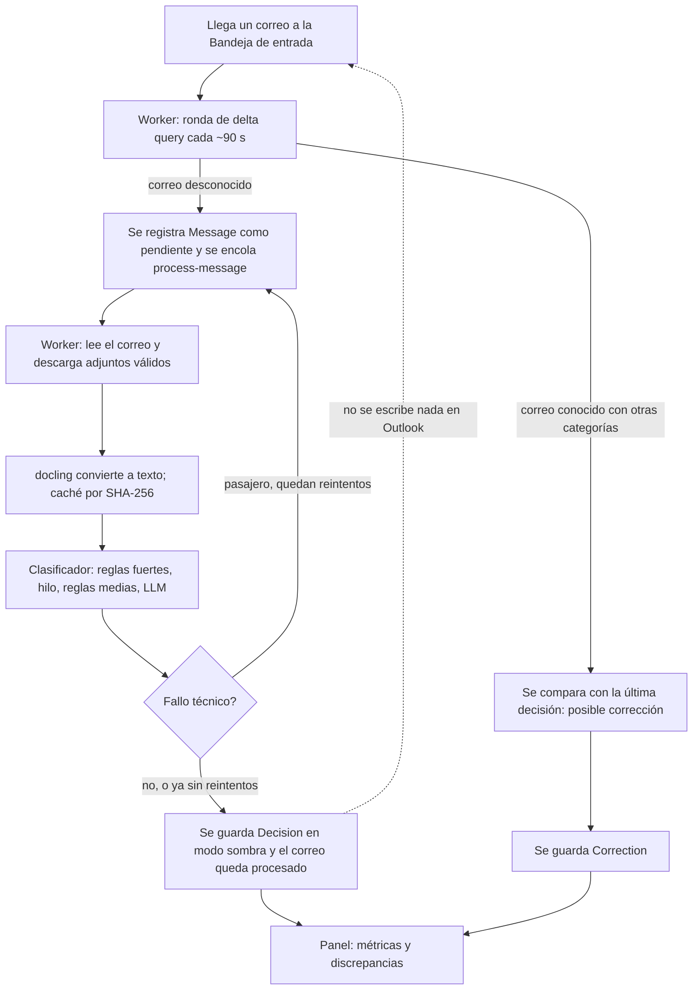

# Arquitectura: cómo funciona hoy

Este documento describe el sistema tal como está construido. El **porqué** de cada decisión está en
los [registros de decisión](adr/README.md); aquí solo se enlaza. Los detalles (campos, valores por
defecto, rutas) los define el código, que se cita por ruta.

Estado: el servicio está construido y probado con datos simulados; **no se ha validado con el buzón
real ni está desplegado**. Solo funciona en modo sombra.

## Piezas

| Pieza | Qué hace | Dónde |
| --- | --- | --- |
| Worker | Sincroniza la Bandeja de entrada, extrae adjuntos, clasifica, guarda decisiones y atiende las peticiones del panel. Es el único que tiene el certificado de Graph y las claves de LLM. | `apps/worker/src/` |
| Web (panel) | Métricas, discrepancias, modelo de LLM, categorías del buzón y configuración. Sin credenciales del buzón: pide al worker por la cola. | `apps/web/src/` |
| PostgreSQL | Datos de la aplicación y la cola de trabajos (pg-boss). | `packages/db/prisma/schema.prisma` |
| docling-serve | Convierte PDF, imágenes, DOCX y XLSX a texto (con OCR si hace falta). Servicio aparte, solo CPU. | imagen de terceros |
| Microsoft Graph | Buzón de Proveedores (lectura) y categorías maestras. | `apps/worker/src/graph/` |
| Proveedor de LLM | Resuelve los casos que las reglas no deciden. Elegible desde el panel. | `apps/worker/src/classify/` |
| Uptime Kuma | Recibe un latido tras cada ronda de sincronización correcta (opcional). | `apps/worker/src/heartbeat.ts` |

Código compartido: `packages/shared` (esquema de la decisión, categorías, CIF, sociedades) y
`packages/db` (esquema, migraciones, semilla, cliente).

## Flujo de un correo, de principio a fin

1. **Detección** (`sync/delta.ts`). Una ronda de delta query sobre la Bandeja de entrada, secuencial y
   con un bloqueo de PostgreSQL que garantiza una sola instancia. Un correo desconocido se registra
   como `pending` y se encola; uno conocido con categorías distintas se compara con su última
   decisión y puede generar una corrección. Un correo que sale de la carpeta solo se cuenta.
   [ADR 0005](adr/0005-sincronizacion-delta-e-instancia-unica.md).
2. **Cola** (`jobs/`). Un trabajo `process-message` por correo, idempotente, con 5 reintentos y
   retroceso. [ADR 0006](adr/0006-cola-de-trabajos-con-pg-boss.md).
3. **Extracción** (`extract/`). Se lee el mensaje y sus adjuntos de fichero (no inline) de tipo PDF,
   imagen, DOCX o XLSX, dentro de los límites de tamaño y páginas. El texto se cachea por hash.
   [ADR 0012](adr/0012-adjuntos-y-extraccion.md).
4. **Clasificación** (`classify/`). Cada categoría se decide por separado, en el orden de abajo.
5. **Guardado.** `Message` y `Decision` en una transacción. Si hubo un fallo técnico se reintenta; si
   se agotan los reintentos la decisión queda marcada como degradada y el correo para reprocesar.
   [ADR 0007](adr/0007-fallos-tecnicos-y-reproceso.md).
6. **Lectura en el panel** (`apps/web/src/server/metrics.ts`). Solo cuentan para el acierto los
   correos que el equipo ha revisado. [ADR 0008](adr/0008-correcciones-y-metrica-de-acierto.md).

## Orden de decisión del clasificador

Por categoría, de mayor a menor prioridad (detalle y motivos en
[ADR 0002](adr/0002-orden-de-decision-del-clasificador.md)):

1. Regla fuerte: CIF o razón social de una de las siete sociedades, en el propio correo. Si el correo
   identifica una sociedad, las categorías de las otras se descartan.
2. Herencia del hilo, con las categorías finales del equipo.
3. Regla media: palabras clave, remitente, dominio.
4. LLM, solo para lo que sigue en duda y existe en el buzón.
5. Duda: sin categoría y para revisión.

Una respuesta por debajo del umbral de confianza (0,8) cuenta como duda. El clasificador solo
propone; nunca quita categorías de personas.

## Datos que se guardan y cuánto tiempo

La lista de tablas y campos está en `schema.prisma`; aquí, lo que importa para la privacidad.

| Dato | Se guarda | Conservación |
| --- | --- | --- |
| Texto extraído de adjuntos | Sí (`AttachmentText`) | 90 días; limpieza diaria |
| Decisiones, correcciones | Sí | Sin límite |
| Remitente, asunto, fecha, conversación y categorías vistas de cada correo | Sí (`Message`) | Sin límite; plazo pendiente de decidir |
| Cuerpo del correo y ficheros adjuntos | No: se leen para clasificar y no se guardan | No aplica |
| Texto pegado en «Probar» | Solo en la cola de trabajos | Se borra al leer el resultado y, como máximo, a los 5 minutos |
| Claves de LLM, certificado | Nunca en la base de datos: variables de entorno y fichero montado en el worker | No aplica |

Lo que se envía al LLM (asunto, cuerpo y texto de las primeras páginas de los adjuntos, con tope de
caracteres) sale hacia el proveedor elegido. [ADR 0003](adr/0003-llm-configurable-y-privacidad.md) y
[ADR 0010](adr/0010-retencion-y-datos-de-terceros.md).

## Qué hace y qué no hace el modo sombra

- **Hace:** leer el buzón (delta, mensajes, adjuntos, categorías maestras), extraer, clasificar,
  llamar al LLM, guardar decisiones y correcciones, mostrarlas en el panel y enviar el latido.
- **No hace:** aplicar categorías a ningún correo. No existe el `PATCH`; con `MODE=live` el worker se
  niega a arrancar. Los interruptores sombra/live del panel solo guardan una preferencia.
- **Única escritura en el buzón:** crear una categoría en la lista maestra cuando un usuario
  autorizado lo pide y confirma en el panel; no toca ningún correo. El worker la ejecuta; la web
  no puede. [ADR 0004](adr/0004-modo-sombra-y-activacion-por-categoria.md) y
  [ADR 0015](adr/0015-web-sin-credenciales-del-buzon.md).

## Límites conocidos

- **Adjuntos `.eml`, `.msg` y `itemAttachment`:** no se leen ni se avisa; un reenvío que adjunta el
  correo original pierde el PDF de dentro. No se ha medido cuántos casos hay.
- **Sin validar con datos reales:** el cliente de Graph, el login con Microsoft, la extracción con
  facturas reales y el acierto de las reglas y del LLM solo se han probado con datos simulados.
- Un cambio de categorías del equipo mientras su correo se procesa no cuenta como corrección.
- La sesión del panel no se puede invalidar en el servidor antes de las 8 horas; el acceso sí se
  corta al instante quitando al usuario de la lista.
- Sin tope de gasto diario del LLM, sin aviso automático de caducidad del certificado ni del secreto
  de login, y sin plazo de conservación de remitentes, asuntos y decisiones: están planificados.
- La imagen del worker pesa unos 2 GB.

## Salud y operación

El worker expone `/livez` (para el contenedor) y `/health` (para Uptime Kuma y personas); la web,
`/api/health`. Qué mide cada uno: [ADR 0017](adr/0017-imagenes-y-comprobaciones-de-salud.md).
Despliegue, copias y caducidades: [operacion/](operacion/despliegue.md).
